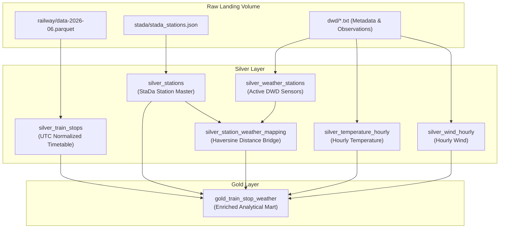

# Zugzwang

Zugzwang is an open-source railway data platform built on Databricks. It processes real-world operational timetable and delay data from Deutsche Bahn alongside contemporaneous meteorological observations from the Deutscher Wetterdienst (DWD).

The platform demonstrates declarative pipeline engineering and multi-domain data reconciliation on Databricks Lakeflow, Unity Catalog, and Delta Lake.

---

## Highlights

- **Multi-domain spatio-temporal reconciliation:** Reconciles operational railway event streams (~14.75M train stops across 5,344 stations in June 2026) with DWD hourly temperature and wind sensor networks lacking shared business keys.
- **Independent sensor proximity resolution:** Maps stations to the nearest active temperature (494 stations) and wind (295 stations) sensors independently using distributed Haversine calculation, avoiding forced-joint network spatial distortion.
- **Databricks Lakeflow Declarative Pipelines:** Transforms raw landing volumes into medallion layers (Silver dimensions/facts and Gold analytical mart) using declarative materialized views (`@dp.materialized_view`).
- **Production-minded development:** Built with Python 3.12, managed with `uv`, tested with PySpark unit fixtures, and packaged as a Databricks Asset Bundle (`databricks.yml`) targeting Serverless compute.

---

## Architecture



For detailed architectural trade-offs, see [Architecture documentation](docs/architecture.md) and [ADR 0001: Source selection and weather integration](docs/decisions/0001-source-selection-and-weather-integration.md).

---

## Data model

### Silver layer

- **`silver_stations`:** Conforming railway station dimension unnested from DB StaDa JSON records (standardized 8-digit zero-padded `eva`, `station_name`, `ds100`, WGS84 coordinates, price and service categories).
- **`silver_weather_stations`:** Harmonized active DWD meteorological stations with `has_temperature` and `has_wind` capability flags.
- **`silver_station_weather_mapping`:** Spatial proximity bridge recording nearest temperature and wind station IDs alongside exact geodesic distances (`nearest_tu_dist_km`, `nearest_ff_dist_km`).
- **`silver_temperature_hourly`:** Normalized DWD Climate Data Center hourly air temperature (`temp_celsius`) and relative humidity (`humidity_pct`) with sentinel `-999.0` handling and quality level flags.
- **`silver_wind_hourly`:** Normalized DWD hourly wind speed (`wind_speed_ms`) and direction (`wind_direction_deg`).
- **`silver_train_stops`:** Standardized operational stop events with Berlin local wall-clock time converted to UTC timestamps and hourly temporal anchors (`event_hour_utc`).

### Gold layer

- **`gold_train_stop_weather`:** Analytical dataset joining train stop events, station attributes, and ambient environmental conditions at the time and location of each stop.

---

## Repository layout

```
zugzwang/
├── databricks.yml           # Databricks Asset Bundle definition
├── resources/               # Modular bundle resource definitions
│   ├── pipelines.yml        # Lakeflow Declarative Pipeline resource
│   └── schemas.yml          # Unity Catalog schemas and volumes
├── pyproject.toml           # Project dependencies and tool configurations (uv)
├── docs/                    # Architecture documentation and ADRs
│   ├── architecture.md
│   ├── glossary.md
│   └── decisions/
├── src/
│   ├── pipeline.py          # Databricks Lakeflow declarative pipeline entrypoint
│   └── zugzwang/            # Reusable core library package
│       ├── config.py        # Path configuration and landing volume resolution
│       ├── spatial.py       # Distributed Haversine calculation and proximity mapping
│       ├── time.py          # Timezone conversion (CEST -> UTC) and hour truncation
│       └── transformations/ # Pure PySpark transformation logic
│           ├── gold.py
│           ├── railway.py
│           ├── stations.py
│           └── weather.py
└── tests/                   # Pytest test suite with Spark fixtures
    ├── conftest.py
    └── unit/
```

---

## Getting started

### Prerequisites

- Python >= 3.12
- [uv](https://github.com/astral-sh/uv)
- [Databricks CLI](https://docs.databricks.com/dev-tools/cli/index.html) for bundle deployment
- Java 17+ for local PySpark unit testing

### Local setup

1. Clone the repository:
   ```bash
   git clone https://github.com/ziyuonmain/zugzwang.git
   cd zugzwang
   ```

2. Install dependencies:
   ```bash
   uv sync
   ```

3. Run the test suite, type checks, and linters:
   ```bash
   uv run pytest
   uv run ty check
   uv run ruff check .
   uv run ruff format --check .
   ```

---

## Deployment

The pipeline is defined and managed as a Databricks Asset Bundle.

1. Validate the bundle configuration:
   ```bash
   databricks bundle validate
   ```

2. Deploy to the development target:
   ```bash
   databricks bundle deploy -t dev
   ```

3. Run the Lakeflow pipeline:
   ```bash
   databricks bundle run -t dev zugzwang_june2026
   ```

---

## License

This project is licensed under the GNU General Public License v3.0 (GPL-3.0). See [LICENSE](LICENSE) for details.
