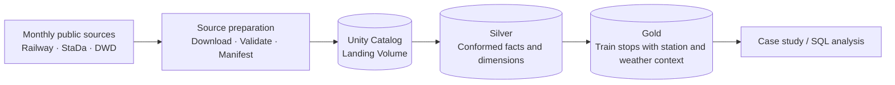

# Zugzwang

Zugzwang is an open-source railway analytics project built on Databricks. It
combines monthly German train-stop records with contemporaneous station data and
nearby hourly weather observations to examine where and when delays and
cancellations concentrate.

June 2026 is the first validated release, not the final scope. The project is
working toward a monthly pipeline that maintains a rolling twelve months of
analysis-ready data under a bounded retention policy.

## What it aims to answer

- Where and when does railway disruption repeatedly concentrate?
- How do patterns differ by station, train category, region, and month?
- How do observed delay distributions vary across weather conditions?

Weather is treated as context for descriptive comparison. Zugzwang does not
claim that weather causes individual delays.

## Why this requires more than one dataset

The sources do not share a ready-made analytical key:

- [piebro/deutsche-bahn-data](https://github.com/piebro/deutsche-bahn-data)
  publishes monthly operational stop events identified by EVA and local railway
  timestamps.
- DB StaDa describes stations, nested EVA identifiers, categories, and
  coordinates.
- Deutscher Wetterdienst (DWD) publishes hourly temperature and wind
  observations from separate sensor networks using UTC timestamps.

Zugzwang standardizes the identifiers, converts railway timestamps to UTC, maps
each station independently to nearby temperature and wind sensors, and retains
distance and quality attributes needed to interpret the resulting joins.

## Current status

| Area | Status |
| --- | --- |
| June 2026 Silver and Gold pipeline | Implemented and materialized on Databricks Serverless |
| End-to-end Lakeflow orchestration | Implemented for the fixed June snapshot |
| June analytical case study | Next deliverable |
| June source-contract hardening | In progress |
| Generic monthly processing | Planned after the June case study and a second real month |
| Rolling twelve-month retention | Planned |

The June source contains approximately 14.75 million stop events across 5,344
distinct EVAs and has six known missing collection hours. Results must expose
this incomplete coverage rather than assume a complete national record.

See [Project roadmap and retention](docs/roadmap.md) for the target monthly
operating model and the distinction between current and planned capabilities.

## Architecture



The Lakeflow Job handles procedural source preparation before triggering a
declarative pipeline of materialized views. Reusable transformations remain
ordinary PySpark functions under `src/zugzwang/`, where they can be tested
locally.

| Dataset | Grain |
| --- | --- |
| `silver.stations` | One usable station EVA |
| `silver.weather_stations` | One active DWD sensor |
| `silver.station_weather_mapping` | One railway EVA with independent nearest temperature and wind sensors |
| `silver.temperature_hourly` | One temperature sensor-hour |
| `silver.wind_hourly` | One wind sensor-hour |
| `silver.train_stops` | One operational train stop |
| `gold.train_stop_weather` | One enriched operational train stop |

Immutable source artifacts remain in the `raw.landing` Volume, which serves as
the Bronze-equivalent boundary without duplicating the files into Bronze
tables.

For design details and source limitations:

- [Architecture](docs/architecture.md)
- [Data sources and provenance](docs/data-sources.md)
- [Roadmap and retention](docs/roadmap.md)
- [ADR 0001: Source selection and weather integration](docs/decisions/0001-source-selection-and-weather-integration.md)
- [ADR 0002: Ingestion snapshot contract](docs/decisions/0002-ingestion-snapshot-contract.md)
- [ADR 0003: Separate Silver and Gold serving schemas](docs/decisions/0003-separate-serving-schemas.md)

## Build with

- Python 3.12 and PySpark
- Databricks Lakeflow Declarative Pipelines and Jobs
- Delta Lake and Unity Catalog
- Databricks Declarative Automation Bundles
- uv, pytest, Ruff, ty, and Task

## Getting started

### Prerequisites

- Python 3.12 or newer
- [uv](https://docs.astral.sh/uv/)
- Java 17 or newer for local PySpark tests
- [Databricks CLI](https://docs.databricks.com/dev-tools/cli/index.html)
- [Task](https://taskfile.dev/) (optional)

### Local verification

```bash
git clone https://github.com/ziyuonmain/zugzwang.git
cd zugzwang
uv sync
task check
```

`task check` runs linting, type checks, unit tests, and strict validation of the
Silver and Gold table definitions under `metadata/`. Use `task metadata:check`
to validate that metadata alone.

### Databricks deployment

```bash
databricks bundle validate -t dev
databricks bundle deploy -t dev
databricks bundle run -t dev zugzwang_pipeline_job
```

The orchestration job runs `prepare_sources` before refreshing the declarative
pipeline.

## Contributing

Issues and focused pull requests are welcome. Before changing source semantics
or architecture, read the relevant documents under `docs/` and preserve the
project's emphasis on verified public data, explicit limitations, and the
smallest design that solves the current problem.

A dedicated `CONTRIBUTING.md` will be added when the repository needs
substantial contributor-specific setup, review, release, or governance
instructions.

## License

Zugzwang is licensed under the [GNU General Public License v3.0](LICENSE).
