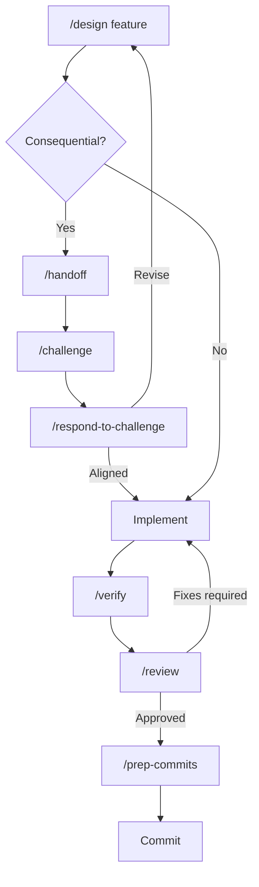

# AI-assisted development workflow

This document describes how AI tooling is used while developing Zugzwang.

The goal is to use AI assistance where it improves exploration,
implementation, and review while keeping human decisions, source evidence,
verification, and commit history explicit.

The maintainer remains responsible for accepting architectural, data-semantic,
and implementation decisions. Passing tests demonstrate tested behavior; they
do not validate undocumented source semantics, which require source inspection
or primary documentation.

## Tool responsibilities

### Implementation agents

Antigravity and OpenAI Codex are used as implementation environments.

Use implementation agents for:

- repository exploration
- research
- architecture proposals
- implementation
- refactoring
- tests
- Databricks configuration
- documentation
- local verification
- preparing commits

Their responsibilities may overlap. The important separation is between
implementation and independent challenge, not between tool vendors.

Implementation agents may make substantial, coherent local changes before they
are committed.

### Independent reviewer

Use a separate model as an independent challenger when a decision or implementation deserves another opinion.

The reviewer should challenge:

- assumptions
- architecture
- technical claims
- source semantics
- unnecessary complexity
- Databricks usage
- implementation correctness
- scope creep
- whether something would withstand senior-level technical discussion

The reviewer should not simply continue the implementation agent's reasoning.
Use a separate model, agent, or fresh review context that can challenge the
proposal independently.

---

## Normal development flow

### Design

For non-trivial new functionality:

```text
/design <goal>
```

Use **high reasoning effort** for:

- architecture
- data modelling
- source evaluation
- ambiguous data semantics
- consequential Databricks decisions
- ADR-worthy decisions

A good `/design` request should normally be short because project rules, skills, ADRs, and existing architecture already provide context.

Example:

```text
/design Generalize the validated June pipeline to process a second monthly
snapshot without introducing a generic ingestion framework.
```

The design workflow should:

- read applicable rules
- use relevant skills
- respect existing ADRs
- inspect the current repository
- propose the smallest useful design
- explicitly state what should be deferred
- avoid reopening accepted decisions without new evidence

Do not immediately implement a design merely because the agent proposed it.

---

### Challenge important decisions

Use independent review when:

- selecting data sources
- accepting a new architecture
- making a consequential modelling decision
- an answer appears overly confident
- Databricks functionality may have been added artificially
- source semantics are uncertain
- the proposed solution seems overengineered

For long implementation sessions, run:

```text
/handoff
```

and give the resulting handoff artifact to the independent reviewer.

Challenge the handoff with:

```text
/challenge .review/handoff.md
```

Then evaluate every finding rather than accepting it automatically:

```text
/respond-to-challenge
```

A handoff should distinguish:

- evidence
- assumptions
- decisions
- implementation
- unresolved questions

Research hypotheses are allowed during exploration.

Committed documentation must contain verified facts.

---

### Implement

Once a design is accepted:

```text
Implement the approved design.
Do not reopen the architecture unless implementation reveals a blocking issue.
```

Normally use **medium reasoning effort** for implementation.

Use high effort only when implementation reveals:

- difficult correctness issues
- ambiguous source behavior
- complex Spark behaviour
- architectural conflicts
- difficult debugging

Allow the implementation agent to make coherent changes across multiple files.

Do not force one AI task to equal one Git commit.

---

### Verify

Before considering a feature complete:

```text
/verify
```

Verification should run only checks that actually apply, such as:

```text
uv run pytest
uv run ruff check .
uv run ruff format --check .
uv run ty check
databricks bundle validate -t dev
```

For data work, verification should also consider:

- dataset grain
- key uniqueness
- row multiplication
- join coverage
- null behavior
- representative source records
- measured rather than assumed data-quality properties

Never claim something was verified unless the corresponding check actually ran.

---

### Review

After implementation:

```text
/review
```

The reviewing agent should inspect the current diff as a senior engineer.

Prioritize:

1. correctness
2. source/data semantics
3. architecture
4. unnecessary complexity
5. Databricks-specific issues
6. tests
7. maintainability

Ignore cosmetic style issues unless they have practical consequences.

For important changes, optionally follow this with:

```text
/handoff
```

and ask for independent review.

---

## Git and commit workflow

An implementation agent may make multiple related changes in the working tree
before commits are created.

Do not automatically commit after each AI task.

When a logical milestone is complete:

```text
/prep-commits
```

The workflow should:

1. inspect the complete working tree;
2. identify logical change groups;
3. propose commit boundaries;
4. keep implementation and directly related tests together;
5. use partial/hunk staging when one file contains changes belonging to different commits;
6. avoid one-commit-per-file grouping;
7. avoid mixing unrelated refactoring and features;
8. ensure commits leave the repository in a meaningful state.

Before creating commits, show the proposed plan.

Example:

```text
1. feat: add DWD source normalization
   - weather transformation
   - associated tests

2. feat: add station-weather mapping
   - spatial transformation
   - mapping tests

3. chore: configure Lakeflow pipeline resource
   - databricks.yml
   - pipeline definitions
```

After approval, create the commits in dependency order.

After committing:

- show the new commit history
- show remaining local changes
- report whether the working tree is clean

Never:

- discard user changes
- amend commits without being asked
- rebase published history without being asked
- force-push
- commit credentials or generated datasets

---

## How to use agent configuration

### Rules

Rules encode behavior that should apply repeatedly without being mentioned in prompts.

Examples:

- project scope
- Python conventions
- evidence requirements
- credential handling
- architectural principles

Do not repeat these rules in every chat message.

### Skills

Skills contain specialized knowledge or procedures.

Examples:

- rail-data-research
- architecture-review

Skills should normally activate automatically from the task context.

Explicitly request a skill only when automatic selection appears insufficient.

### Workflows

Workflows describe repeatable processes and should be invoked explicitly.

Primary workflows:

```text
/design
/handoff
/challenge
/respond-to-challenge
/verify
/review
/prep-commits
```

### Roles

Roles are optional perspectives such as architect, engineer, and reviewer.

Do not invoke roles merely because they exist.

Prefer workflows when a workflow already captures the desired behavior.

---

## Reasoning effort

Recommended default:

```text
Architecture / research / source semantics    HIGH
Implementation                               MEDIUM
Tests / straightforward refactoring          MEDIUM
Verification                                 MEDIUM
Complex debugging                            HIGH
Consequential review                         HIGH
```

Higher reasoning effort does not replace evidence or verification.

---

## General principle

Use the AI environment so that prompts can become shorter over time.

Instead of repeatedly writing detailed instructions, improve:

- rules for persistent constraints;
- skills for reusable expertise;
- workflows for repeated procedures;
- ADRs for accepted architectural decisions.

A healthy workflow should increasingly look like:



The repository, ADRs, rules, committed documentation, and tests are the durable
project memory.

The `.review/` directory is ignored by Git. Handoffs, challenges, and
challenge responses are temporary working artifacts. Accepted conclusions must
be transferred into code, tests, ADRs, rules, or committed documentation.

Chat history is not.
