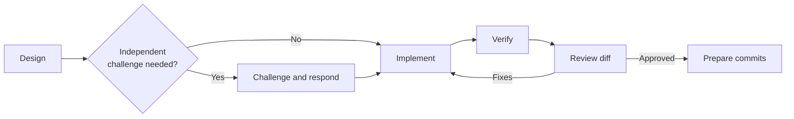

# AI-assisted development workflow

This document describes how AI assistance is used in Zugzwang. The objective is
not to maximize generated code. It is to improve exploration, implementation,
and review while keeping evidence, decisions, verification, and commit history
explicit.

The maintainer remains responsible for accepting architectural, data-semantic,
and implementation decisions. Passing tests demonstrate tested behavior; they
do not establish undocumented source semantics.

## Principles

- Inspect the repository and relevant source data before proposing non-trivial
  changes.
- Prefer the smallest implementation that addresses an identified requirement.
- Distinguish verified facts, assumptions, decisions, and unresolved questions.
- Verify source semantics with inspected records or primary documentation.
- Use an independent review context for consequential or uncertain decisions.
- Never claim a check or deployment succeeded unless it actually ran.
- Transfer accepted conclusions into code, tests, ADRs, rules, or committed
  documentation; chat history is not project memory.

The repository rules under `.agents/rules/` define the persistent engineering,
scope, evidence, and credential constraints. They apply whether development is
manual or AI-assisted.

## Development lifecycle



### 1. Design

Use `/design` before non-trivial functionality or consequential architecture
changes. A design should:

- identify the concrete requirement;
- inspect relevant implementation and data;
- state important assumptions;
- respect accepted ADRs unless new evidence justifies revisiting them;
- propose the smallest useful design; and
- state what remains deferred.

Use greater reasoning effort for architecture, source evaluation, ambiguous
semantics, and decisions that may require an ADR. A proposed design is not
automatically approved for implementation.

### 2. Challenge consequential decisions

Use independent challenge when selecting sources, changing architecture,
interpreting uncertain source semantics, or introducing significant Databricks
functionality.

For a long implementation or design session:

```text
/handoff
/challenge .review/handoff.md
/respond-to-challenge
```

Evaluate each finding against evidence. Do not accept or reject a challenge
merely because another model produced it. Files under `.review/` are temporary
and ignored by Git.

### 3. Implement

After the design is understood, implement a coherent change rather than forcing
one AI request to equal one file or one commit. Keep reusable logic under
`src/zugzwang/`, keep notebooks thin, and add directly related tests with the
implementation.

Do not reopen an accepted design unless implementation reveals a correctness,
source-semantic, or architectural problem.

### 4. Verify

Run `/verify` or the applicable checks directly. The normal local baseline is:

```bash
task check
```

Bundle changes also require the relevant target validation:

```bash
task validate:dev
```

Data changes require more than code checks. Verify the applicable grain, key
uniqueness, row-count preservation, join coverage, null behavior, target-period
coverage, and representative source records.

### 5. Review

Use `/review` after implementation. Review in this order:

1. correctness;
2. data and source semantics;
3. architecture and scope;
4. Databricks behavior;
5. tests and failure handling; and
6. maintainability.

Cosmetic issues matter only when they reduce readability or create practical
maintenance problems.

### 6. Prepare commits

Use `/prep-commits` when the working tree is ready. The workflow inspects all
local changes, proposes logical commit boundaries, and waits for approval before
staging or committing.

Keep implementation, its tests, and directly related documentation together.
Use partial staging when one file contains unrelated changes. Never discard
user changes, rewrite published history, force-push, or commit credentials and
generated datasets.

## Configuration responsibilities

The agent configuration has four distinct purposes:

| Configuration | Purpose | Examples |
| --- | --- | --- |
| Rules | Persistent project constraints | Scope, coding conventions, evidence, credentials |
| Skills | Specialized review or research procedures | Rail-data research, architecture review |
| Workflows | Explicit repeatable processes | Design, challenge, verification, commit preparation |
| ADRs | Durable architectural decisions | Source selection, ingestion contract, serving schemas |

Rules and ADRs reduce repeated prompt context. Skills should activate when the
task requires their expertise. Workflows are invoked explicitly when their
process is needed.

## Available workflows

Detailed workflow instructions live under `.agents/workflows/`:

- `/design`
- `/handoff`
- `/challenge`
- `/respond-to-challenge`
- `/verify`
- `/review`
- `/prep-commits`

Keep this document focused on the overall lifecycle. Update the individual
workflow file when its detailed procedure changes.
