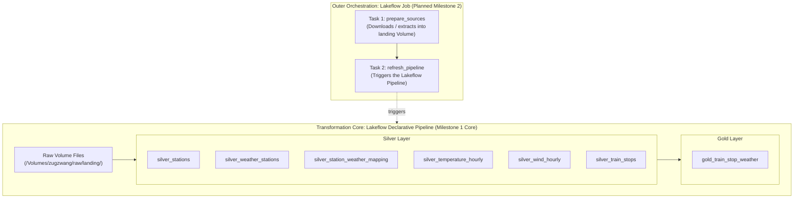

# Architecture

## Overview

Zugzwang is an open-source railway data platform built on Databricks to explore German railway operations and demonstrate production-grade data engineering.

---

## Responsibility split

Zugzwang strictly separates declarative data transformation graphs from procedural orchestration tasks:

### Declarative pipeline

The Lakeflow Declarative Pipeline is defined in `src/zugzwang/pipeline.py`.

- **Role:** Owns all `Raw -> Silver -> Gold` dataset transformations and joins.
- **Paradigm:** Declarative, distributed PySpark DataFrames (`@dp.materialized_view`).
- **Responsibilities:**
  - Ingesting raw immutable files directly from `/Volumes/zugzwang/raw/landing/`.
  - Data quality enforcement via declarative expectations.
  - Dependency resolution, concurrency management, and ACID Delta Lake materialization.
  - Real-time DAG lineage and dataset monitoring.
- **Constraints:** No driver memory collection (`toPandas()`, `collect()`), no procedural I/O scripts.

### Orchestration job

The outer orchestration job coordinates operational tasks outside the declarative transformation graph:

- **Role:** Owns procedural, heterogeneous workflows.
- **Planned Tasks:**
  1. `prepare_sources`: Procedural task (`spark_python_task`) responsible for automated download of monthly railway parquet releases, StaDa snapshots, and DWD meteorological archives into the Unity Catalog Volume.
  2. `refresh_pipeline`: Pipeline task (`pipeline_task`) that triggers execution of the Lakeflow Declarative Pipeline.

---

## Roadmap

### Milestone 1: Core pipeline

*Status: Current*

- Land raw source files manually/statically in Unity Catalog landing Volume (`data-2026-06.parquet`, `stada_stations.json`, extracted DWD `.txt` files).
- Validate the Lakeflow Declarative Pipeline end-to-end on Databricks Serverless compute.
- Verify 100% join match rates and schema conformity on `gold_train_stop_weather`.

### Milestone 2: Automated ingestion

*Status: Next*

- Implement `prepare_sources` task to fetch upstream source data automatically.
- Configure and deploy the multi-task Lakeflow Job in `databricks.yml` to orchestrate end-to-end runs (`prepare_sources` $\to$ `refresh_pipeline`).
