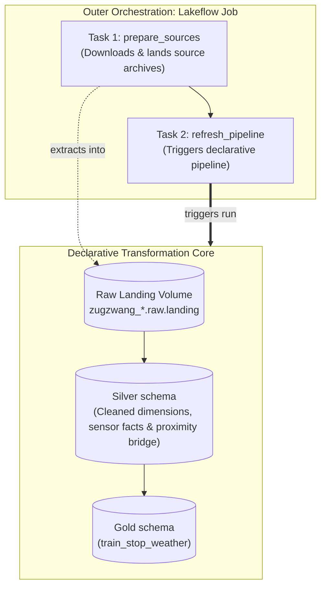

# Architecture

## Overview

Zugzwang is an open-source railway data platform built on Databricks to explore German railway operations and demonstrate production-grade data engineering.

---

## Responsibility split

Zugzwang strictly separates declarative data transformation graphs from procedural orchestration tasks:

### Declarative pipeline

The Lakeflow Declarative Pipeline is defined in `src/zugzwang/pipeline.py`.

- **Role:** Owns all `Raw -> Silver -> Gold` dataset transformations and joins.
- **Paradigm:** Declarative, distributed PySpark DataFrames (`@dp.materialized_view`).
- **Responsibilities:**
  - Reading a previously validated landing snapshot from `/Volumes/zugzwang_*/raw/landing/`.
  - Deterministic normalization and analytical joins.
  - Dependency resolution, concurrency management, and ACID Delta Lake materialization.
  - Real-time DAG lineage and dataset monitoring.
- **Constraints:** No driver memory collection (`toPandas()`, `collect()`), no procedural I/O scripts.

A direct pipeline refresh is supported only when the configured landing
snapshot has already passed manifest validation. The end-to-end entry point is
the outer Lakeflow Job, which prepares and validates sources before it triggers
the pipeline.

### Unity Catalog layout

The bundle separates assets by responsibility while retaining one declarative
pipeline:

- `raw` contains the managed `landing` Volume with immutable upstream files.
- `silver` contains normalized, reusable materialized views.
- `gold` contains analytical datasets intended for downstream consumption.

The raw schema is the project's Bronze-equivalent boundary. It deliberately
uses the more literal name `raw` because it contains source files rather than
duplicative Bronze Delta tables. The pipeline defaults to `silver` and uses a
fully qualified name for its Gold output, preserving a single dependency graph
and end-to-end lineage across both schemas.

### Orchestration job

The outer orchestration job coordinates operational tasks outside the declarative transformation graph:

- **Role:** Owns procedural, heterogeneous workflows.
- **Tasks:**
  1. `prepare_sources`: Procedural task (`spark_python_task`) responsible for automated download of monthly railway parquet releases, StaDa snapshots, and DWD meteorological archives into the Unity Catalog Volume.
  2. `refresh_pipeline`: Pipeline task (`pipeline_task`) that triggers execution of the Lakeflow Declarative Pipeline.

---

## Roadmap

### Milestone 1: Core pipeline

*Status: Complete for the June 2026 vertical slice*

- Land raw source files manually/statically in Unity Catalog landing Volume (`data-2026-06.parquet`, `stada_stations.json`, extracted DWD `.txt` files).
- Validate the Lakeflow Declarative Pipeline end-to-end on Databricks Serverless compute.
- Verify 100% join match rates and schema conformity on `gold.train_stop_weather`.

### Milestone 2: Automated ingestion

*Status: Implemented for the fixed June 2026 snapshot; contract hardening in progress*

- `prepare_sources` fetches and validates the configured upstream source data.
- The multi-task Lakeflow Job orchestrates end-to-end runs
  (`prepare_sources` $\to$ `refresh_pipeline`).
- Publish immutable period snapshots using the contract in
  [ADR 0002](decisions/0002-ingestion-snapshot-contract.md).

### Milestone 3: Analytical case study and monthly proof

*Status: Next*

- Publish the June delay, cancellation, coverage, and weather-context case study.
- Complete the remaining June source-contract hardening listed in the roadmap.
- Process a second real month before generalizing ingestion or enabling a
  recurring schedule.
- Measure runtime and storage before enabling recurring operation.
