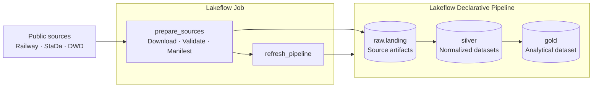

# Architecture

## Overview

Zugzwang is a monthly batch analytics platform for German railway operations.
It uses Databricks to acquire a fixed public-data snapshot, normalize railway,
station, and weather records, and publish one analysis-ready dataset.

The implementation separates procedural source acquisition from declarative
data transformation:



## Responsibility boundaries

### Source preparation

The `prepare_sources` task runs [src/prepare_sources.py](../src/prepare_sources.py).
It owns operations that are procedural or external to the transformation graph:

- downloading the configured railway, StaDa, and DWD sources;
- extracting the canonical files consumed by Spark;
- validating source-specific structure and the complete candidate snapshot;
- hashing and recording artifact provenance;
- publishing artifacts to the landing Volume; and
- writing `manifest.json` last as the completion marker.

A valid snapshot is immutable. Reruns verify its manifest and content digests
and then exit without replacing it. Foreign or corrupted snapshots are left in
place for investigation. [ADR 0002](decisions/0002-ingestion-snapshot-contract.md)
defines this contract.

### Declarative transformation

The `refresh_pipeline` task triggers the pipeline defined in
[src/pipeline.py](../src/pipeline.py). The pipeline owns the deterministic
Raw-to-Silver and Silver-to-Gold graph:

- reading a manifest-validated snapshot from the `raw.landing` Volume;
- normalizing source identifiers, timestamps, and missing values;
- mapping each railway EVA independently to temperature and wind sensors;
- joining train stops with station and hourly weather context;
- applying Lakeflow expectations; and
- materializing the published Silver and Gold schemas.

Reusable transformations remain ordinary PySpark functions under
`src/zugzwang/`. This keeps source parsing, normalization, spatial mapping, and
analytical joins testable outside the Databricks pipeline runtime.

## Unity Catalog layout

The bundle creates one catalog per target and separates datasets by
responsibility:

| Object | Purpose |
| --- | --- |
| `raw.landing` | Managed Volume containing the immutable source snapshot, retained archives, derived source files, and manifest |
| `silver.stations` | Station attributes at usable-EVA grain |
| `silver.weather_stations` | DWD stations eligible for temperature or wind mapping during June 2026 |
| `silver.station_weather_mapping` | Independent nearest-temperature and nearest-wind mapping at railway-EVA grain |
| `silver.temperature_hourly` | June temperature and humidity observations at station-hour grain |
| `silver.wind_hourly` | June wind observations at station-hour grain |
| `silver.train_stops` | Normalized operational events at train-stop grain |
| `gold.train_stop_weather` | Train stops enriched with station and hourly weather context |

The landing Volume is the project's Bronze-equivalent boundary. It preserves
the source artifacts without creating Delta tables that would only duplicate
them. Silver and Gold are materialized views managed by one triggered,
serverless Lakeflow pipeline. [ADR 0003](decisions/0003-separate-serving-schemas.md)
records the schema decision.

## Deployment and execution

Databricks Declarative Automation Bundles define the development and production
targets in `databricks.yml` and the resources under `resources/`.

The supported end-to-end command is:

```bash
task run-job
```

The job has `max_concurrent_runs: 1`, so two source-publication runs cannot
overlap through this entry point. A direct pipeline run is supported only when
the configured landing snapshot already has a valid manifest and matching
artifacts.

For deployment instructions, see [Initial dataset setup](initial-dataset-setup.md).
For implemented and planned milestones, see the [Project roadmap](roadmap.md).

## Current scope boundaries

The current implementation is intentionally fixed to June 2026. It does not
yet provide:

- arbitrary-month processing;
- recurring scheduling;
- rolling retention;
- streaming ingestion;
- historical station-dimension management; or
- causal or predictive modelling.

These capabilities should be added only after a concrete analytical or
operational requirement justifies them.
